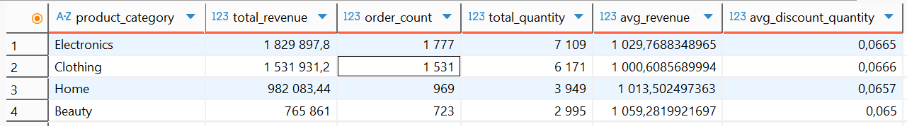
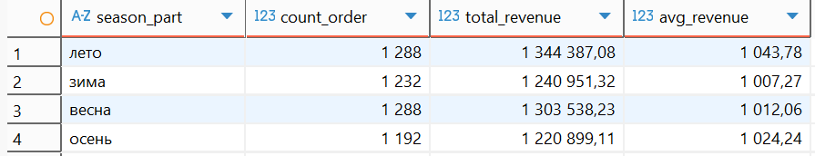
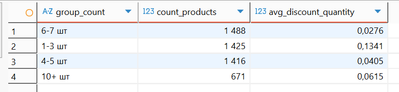
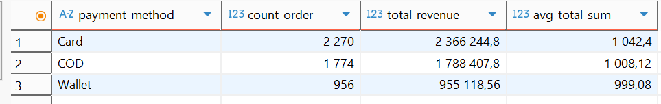
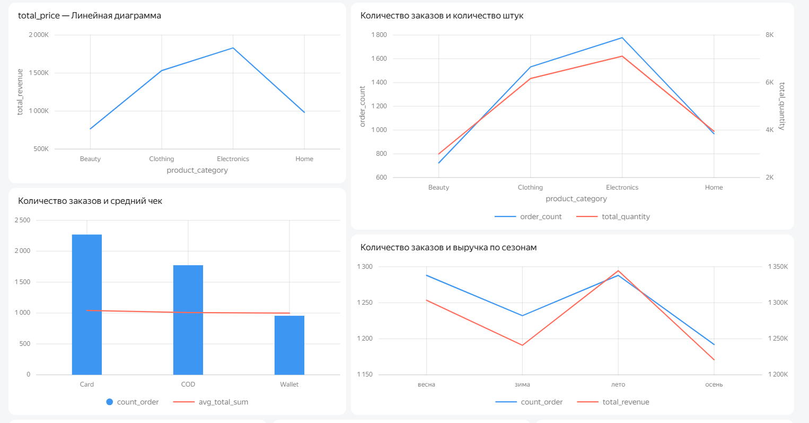
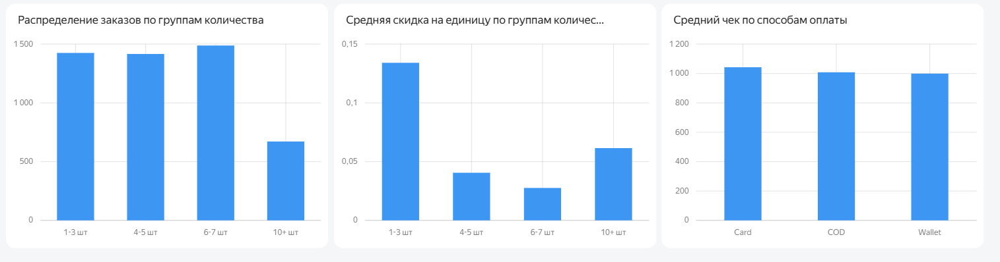

# Исследование факторов, влияющих на выручку
## Оглавление 
- Описание проекта
- Исходные данные
- Таблицы
- Запросы
- Анализ

## Описание проекта
Аналитическое исследование на основе датасета, имитирующего работу современного онлайн-рынка.

**Цель**: выявить ключевые факторы, которые влияют на выручку

**Задачи**: 
1.	Определить саму прибыльную категорию товаров
2.	Проанализировать сезонность продаж 
3.	Проверить зависимость размера скидки от количества купленных товаров
4.	Посмотреть связь способа оплаты с суммой чека

## Исходные данные
Данные взяты с Kaggle: https://www.kaggle.com/datasets/abbas829/ecommerce-sales-dataset

**Название**: Ecommerce sales dataset

**Исходная таблица**

- order_id – id заказа
- order_date – дата оформления заказа
- customer_id – id клиента
- product_category – категория продукта 
- region – регион 
- quantity – количество 
- unit_price – цена за штуку товара
- discount – скидка 
- payment_method – способ оплаты
- delivery_days – срок доставки (в днях)
- customer_rating – рейтинг клиента 
- revenue – итоговая стоимость 

**Таблицы**
Для удобной работы, разбила все на 3 таблицы 
**Таблица пользователей: **
```sql
create table customers as
	select customer_id, customer_rating
	from ecommerce_sales
```
**Данные заказа:**
```sql
create table order_item as
	select order_id, product_category, quantity, unit_price, discount, revenue
	from ecommerce_sales 
```
**Заказ:**
Для удобства сразу изменила форму даты
```sql
create table orders as
	select distinct order_id, customer_id, to_date(order_date, 'mm/dd/yyyy') as date, 
		region, payment_method, delivery_days
	from ecommerce_sales
```

## Запросы 
1.	**Выручка по категориям**
```sql
select product_category, sum(revenue) as total_revenue, count(order_id) as order_count, 
	sum(quantity) as total_quantity, avg(revenue) as avg_revenue, 
	round(avg(discount::decimal/quantity),4) as avg_discount_quantity
from order_item
group by product_category 
order by total_revenue desc
```


В данном запросе берутся данные по позициям товаров и группируются по категориям товаров:
- Общая выручка
- Количество позиций — сколько раз товары из категории были в заказах
- Общее количество штук — сколько товара продано в этой категории
- Средняя выручка на одну позицию
- Средняя скидка на одну единицу товара
2.	**Сезонность** 
```sql
with season_table as (select case when date_part('month', date) in (1,2,12) then 'зима'
							when date_part('month', date) in (3,4,5) then 'весна'
							when date_part('month', date) in (6,7,8) then 'лето'
							else 'осень'
							end as season_part, 
							order_id
						from orders)
						
select season_part, count(st.order_id) as count_order, sum(total_sum) as total_revenue, 
	round(avg(total_sum),2) as avg_revenue
from season_table st
left join (select order_id, sum(revenue)::decimal as total_sum
			from order_item
			group by order_id) ot
on st.order_id = ot.order_id
group by st.season_part
 ```


В запросе берутся данные о заказах из таблицы orders, и для каждого заказа по дате создания определяется сезон, когда он был сделан. Затем для каждого заказа считается общая сумма, и после группируется по сезонам.
3.	**Скидка от количества товаров**
```sql
select case 
		when quantity between 1 and 2 then '1-3 шт'
		when quantity between 4 and 5 then '4-5 шт'
		when quantity between 6 and 7 then '6-7 шт'
		when quantity between 8 and 9 then '8-9 шт'
		else '10+ шт'
		end as group_count,
		count(*) as count_products, round(avg(discount::decimal/quantity),4) as avg_discount_quantity
from order_item oi 
where quantity > 0
group by group_count 
order by count_products desc 
```


В запросе берутся данные о каждой позиции заказа и группируются по их количеству в позиции. Для каждой группы считается, сколько позиций и какая средняя скидка на единицу товара. 
4.	**Связь между способом оплаты и чеком**
```sql
select payment_method, count(distinct order_id) as count_order, 
	sum(total_sum) as total_revenue, round(avg(total_sum)::decimal,2) as avg_total_sum
from orders o 
left join (select order_id, sum(revenue) as total_sum
			from order_item
			group by order_id) oi
using (order_id)
group by payment_method 
 ```


В запросе берутся данные о заказах из таблицы orders, для каждого заказа рассчитывается общая сумма (из таблицы order_item). Затем заказы группируются по способу оплаты.

## Анализ 



По категориям лидирует электроника с выручкой 1,83 млн, что на 300 тыс. больше, чем у одежды (1,53 млн). При этом одежда продаётся почти так же часто, но дешевле, поэтому уступает по деньгам. Средний чек выше всего в электронике (1029,8). Скидки на единицу примерно одинаковы во всех категориях (около 0,065–0,066).

Сезонность выражена умеренно: лето — пик по выручке (1,34 млн) и среднему чеку (1043,8), а осень — спад (1,22 млн и 1192 заказа). Разница между летом и осенью около 10 %. Зимой и весной показатели близки, а летний спрос может быть связан с отпусками или сезонными товарами.

Скидки показывают, что самые высокие скидки на единицу приходятся на мелкие заказы (1–3 шт), тогда как при покупке от 6 штук скидка падает до 0,028–0,04. Это означает, что скидка не поощряет крупные закупки, а наоборот, выгоднее брать меньше. 

По способам оплаты карта лидирует: 2270 заказов, при этом средний чек карты (1042,4) выше, чем у COD (1008,1) и Wallet (999,1). Карта приносит почти 2,37 млн выручки — вдвое больше, чем Wallet. COD остаётся вторым по популярности, но его средний чек ниже.

Целью исследования было выявление ключевых факторов, влияющих на выручку интернет-магазина, и проверка гипотез о поведении клиентов. В ходе анализа были изучены четыре аспекта: структура продаж по категориям, сезонность, эффективность скидочной политики и связь способа оплаты с суммой чека. 

Главным фактором, определяющим объём выручки, является категорийная структура продаж. Электроника приносит почти на 300 тыс. больше, чем одежда, и это соотношение сохраняется на всём протяжении анализируемого периода. При этом одежда остаётся самой популярной категорией по числу заказов, однако низкая цена товаров не позволяет ей обогнать электронику по финансовым показателям.

Вторым значимым фактором оказалась сезонность, хотя её влияние выражено умеренно. Летний пик продаж с максимальной выручкой и самым высоким средним чеком заметно отличается от осеннего спада, причём разница достигает 10 % как по выручке, так и по числу заказов. Это позволяет планировать акции и рекламные кампании с учётом сезонных колебаний.

Наиболее важным результатом стала оценка скидочной политики. Текущая система не только не стимулирует увеличение количества товаров в заказе, но и поощряет мелкие покупки, так как самые высокие скидки на единицу приходятся на заказы до 3 единиц. Таким образом, скидки снижают маржинальность без отдачи в виде роста объёмов. Это требует пересмотра подхода: оптимальным решением станет внедрение прогрессивной шкалы, при которой скидка возрастает с количеством товара, либо замена скидок на другие инструменты.

Четвёртый фактор (способ оплаты) показал, что карта является абсолютным лидером как по популярности, так и по доходности: более 2,27 тыс. заказов и почти 2,37 млн выручки при среднем чеке 1042,4. При этом COD уступает карте по среднему чеку, а wallet — по всем показателям. 
