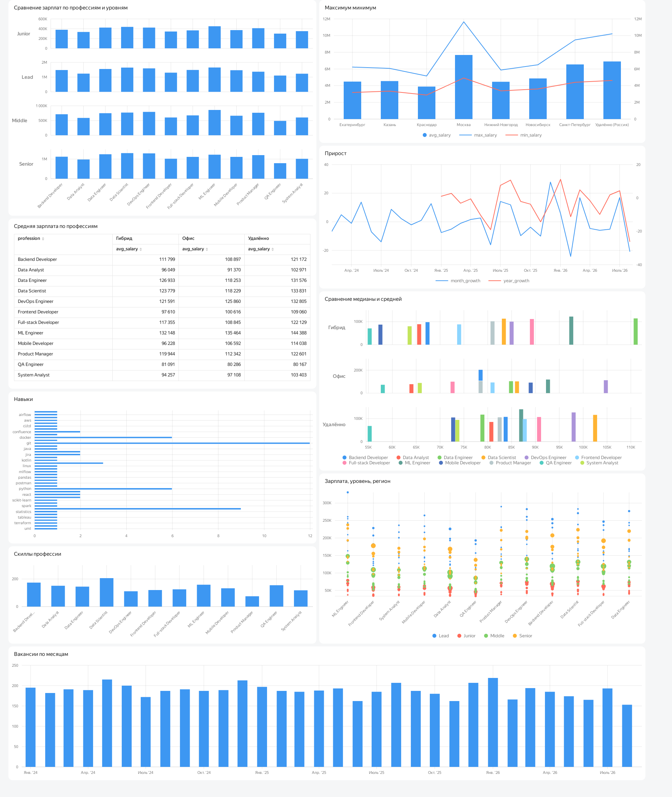
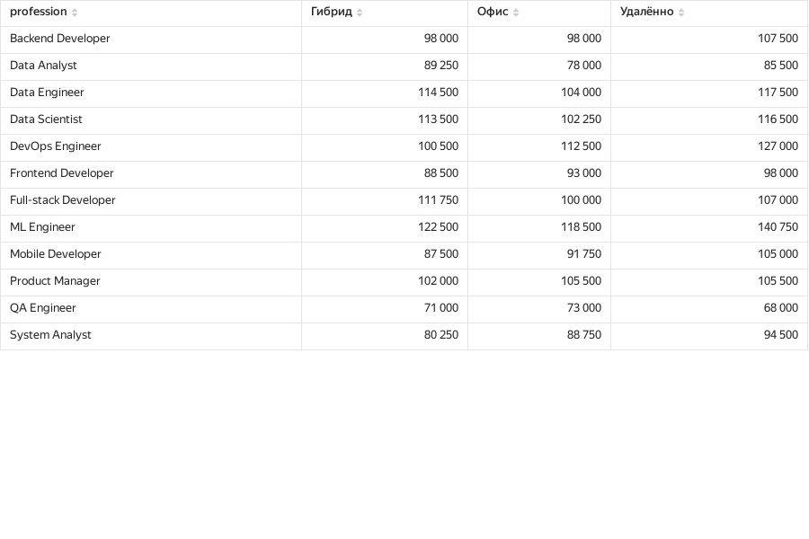

# Рынок труда в IT
## Оглавление 
- Описание проекта
- Запросы
- Анализ
- Проверка гипотез
- Вывод

## Описание проекта 
Аналитическое исследование российского рынка труда в IT-сфере на основе данных о вакансиях. 
В базу входят такие параметры, как профессия, уровень опыта, регион, формат работы, зарплатная вилка (от/до), а также перечень ключевых навыков.

**Цель**: выявить ключевые тренды и закономерности IT-рынка труда 

**Задачи**: 
1. Зарплатный рейтинг профессий по уровням опыта
2. Анализ динамики рынка во времени
3. Сравнение форматов работы (офис / гибрид / удалённо)
4. Географический анализ зарплат
5. Сравнение средней и медианной зарплаты
6. Частотный анализ навыков

**Гипотезы**:
1. Удалёнка даёт высокую зарплату

Предполагается, что для большинства IT-профессий средняя зарплата для удаленки выше, чем в офисе, поэтому компании экономят на аренде и инфраструктуре.
Проверяется сравнением средних зарплат по каждой профессии для офисных и удалённых вакансий.

2. Гибридный формат занимает промежуточное положение

Гибрид даёт зарплату выше офисной, но ниже удалёнки, при этом разброс зарплат (iqr) у гибрида меньше, чем у удалёнки.

3. Git, SQL - универсальные навыки, встречающиеся почти во всех профессиях

Эти компетенции являются базовыми в IT, они есть в более чем 80% вакансий практически любой специальности, и их наличие не даёт конкурентного преимущества, а скорее является обязательным базовым требованием.

4. У профессий с высокой средней зарплатой медиана значительно ниже средней

У ML Engineer, DevOps и Data Engineer средняя зарплата часто выше медианной, из-за того, что несколько вакансий с очень высокими зарплатами повышаю среднюю вверх. Но большинство специалистов в этих профессиях зарабатывают на уровне медианы, она лучше отражает реальную ситуацию на рынке.

5. Навыки из сферы Data Science и ML дают наибольшую зарплату

Вакансии, требующие Python, pandas или аналогичных инструментов, в среднем оплачиваются выше, чем вакансии без этих навыков. Data Scientist и ML Engineer входят в число самых высокооплачиваемых профессий.

**Исходные данные**

База данных it_market содержит информацию о вакансиях в сфере информационных технологий, собранных с платформ по поиску работы за период с января 2024 по август 2026 года. 
Таблица включает сведения о более чем 5 000 вакансий и представляет собой IT-рынок труда в России.

**Структура таблицы**
- vacancy_id - id вакансии
- date_posted - дата публикации вакансии
- profession - профессия
- experience_level - уровень опыта
- region - регион
- work_format - формат работы (офис/гибрид/удаленка)
- company_size - размер компании (стартап/малая/средняя/крупная)
- key_skills - скиллы для вакансии
- salary_from_rub - минимум вилки зарплаты
- salary_to_rub - максимум вилки зарплаты
- currency - валюта


## Запросы
1. **Рейтинг профессий по зарплате с учётом региона и уровня опыта**
```sql
select rank() over (partition by experience_level order by avg_salary desc) as rank_level, *
from (select profession, region, experience_level, count(*) as count_prof, 
			round(avg((salary_to_rub + salary_from_rub)/2),0) as avg_salary,
			min(salary_from_rub) as min_salary, max(salary_to_rub) as max_salary
		from it_market
		group by profession, region, experience_level) grouped
order by rank_level, experience_level 
```
Этот запрос решает задачу ранжирования IT-профессий по уровню средней заработной платы отдельно для каждого уровня опыта (Junior, Middle, Senior, Lead). 
При этом он учитывает региональную специфику: профессия и регион рассматриваются совместно, чтобы видеть, как меняется зарплата для одной и той же специальности в разных городах.

**Итоговая таблица**
| Значение | Описание |
| :--- | :--- | 
| rank_level | Ранг профессии внутри уровня опыта (1 – самая высокая зарплата) |
| profession	| Название профессии |
| region	| Регион, в котором опубликована вакансия |
| experience_level	| Требуемый уровень опыта (Junior, Middle, Senior, Lead) |
| count_prof	| Количество вакансий для данной комбинации |
| avg_salary	| Средняя зарплата в рублях |
| min_salary	| Минимальная зарплата в вилке (salary_from) |
| max_salary	| Максимальная зарплата в вилке (salary_to) |

2. **Анализ динамики рынка труда во времени**
```sql
with month_status as (select date_trunc('month', date_posted::date)::date as month_part,
							count(*) as count_vacans
						from it_market
						group by month_part)

select month_part, count_vacans, lag(count_vacans) over (order by month_part) as pre_month,
		round((count_vacans - lag(count_vacans) over (order by month_part)) * 100.0/lag(count_vacans) over (order by month_part), 2) as month_growth,
		lag(count_vacans, 12) over (order by month_part) as year_ago,
		round((count_vacans - lag(count_vacans, 12) over (order by month_part)) * 100.0/lag(count_vacans, 12) over (order by month_part), 2) as year_growth
from month_status
order by month_part
```
Данный запрос выполняет анализ временной динамики IT-рынка труда на основе количества опубликованных вакансий. 
Он позволяет отслеживать, как меняется спрос на IT-специалистов помесячно, выявлять сезонные колебания и оценивать тренды с помощью месячного прироста (показывает краткосрочные колебания и реакцию рынка на внешние факторы) и 
годового прироста (демонстрирует рост или спад рынка за год)

**Итоговая таблица**
| Значение | Описание |
| :--- | :--- | 
| month_part |	Первый день месяца |
| count_vacans |	Количество вакансий в этом месяце |
| pre_month |	Количество вакансий в предыдущем месяце |
| month_growth |	Месячный прирост |
| year_ago |	Количество вакансий за тот же месяц прошлого года |
| year_growth |	Годовой прирост |

В месячном приросте, если значение положительное, то рынок растет, отрицательное - падает. 
В годовом приросте положительное значение значит, что рынок устойчив. 

3. **Сравнение форматов работы и распределение зарплат**
```sql
with work_type as (select profession, work_format, count(*) as vacancies,
						round(avg((salary_to_rub+salary_from_rub)/2),0) as avg_salary,
						round(percentile_cont(0.25) within group (order by ((salary_to_rub+salary_from_rub)/2))::numeric,0) as v1,
						round(percentile_cont(0.5) within group (order by ((salary_to_rub+salary_from_rub)/2))::numeric,0) as median,
						round(percentile_cont(0.75) within group (order by ((salary_to_rub+salary_from_rub)/2))::numeric,0) as v3,
						min(salary_from_rub) as min_salary, max(salary_to_rub) as max_salary
					from it_market
					group by profession, work_format)
					
select profession, work_format, vacancies, avg_salary, median, v1, v3, (v3-v1) as iqr, min_salary, max_salary
from work_type
group by profession, work_format, vacancies, avg_salary, median, v1, v3, min_salary, max_salary
```
Данный запрос выполняет анализ зарплат в разрезе профессий и форматов работы (офис, гибрид, удалённо). 
Вычисляются квартили и медиана, что позволяет оценить разброс зарплат, выявить выбросы и понять, насколько стабилен рынок для каждой комбинации профессии и формата.

**Итоговая таблица**
| Значение | Описание |
| :--- | :--- | 
| profession | IT-профессии |
| work_format |	Формат работы |
| vacancies |	Количество вакансий в группе |
| avg_salary | Средняя зарплата |
| median |	Медианная зарплата |
| v1 (Q1) |	Первый квартиль (25% вакансий) |
| v3 (Q3) |	Третий квартиль (75% вакансий) |
| iqr (Q3-Q1) |	Межквартильный размах |
| min_salary |	Минимальная зарплата |
| max_salary |	Максимальная зарплата |

Если avg_salary заметно выше median, то в группе есть дорогие выбросы (несколько предложений тянут среднюю вверх).

Если avg_salary примерно равен median, то распределение симметричное.

Маленький iqr означает, что рынок стабильный, зарплаты предсказуемы, компании предлагают схожие условия.

Большой iqr означает, что рынок нестабильный, есть как дешёвые, так и очень дорогие предложения. Это может быть связано с разным уровнем требований или типом компаний.

4. **Частотный анализ ключевых навыков**
```sql
with total as (select count(*) as total_count
				from it_market),

	skills as (select profession, unnest(string_to_array(key_skills, ',')) as skill_vacans
				from it_market)
				
select profession, trim(lower(skill_vacans)) as skill, count(skill_vacans) as skill_count,
	round(100.0 * count(skill_vacans)/total_count,2) as prc,
	dense_rank() over (order by trim(lower(skill_vacans))) as rank_skills
from skills s
cross join total t
group by profession, skill, total_count
order by rank_skills
```

Данный запрос выполняет частотный анализ ключевых навыков (key_skills) в разрезе профессий. 
Он позволяет определить, какие компетенции наиболее востребованы на рынке IT-труда, выявить универсальные навыки (встречающиеся во многих профессиях) и специализированные (только для узких ролей).

**Итоговая таблица**
| Значение | Описание |
| :--- | :--- | 
| profession |	Название IT-профессии |
| skill |	Название навыка |
| skill_count |	Количество упоминаний навыка в вакансиях профессии |
| prc |	Доля упоминаний навыка от общего числа вакансий в таблице |
| rank_skills |	Глобальный ранг навыка |

## Анализ



При анализе зарплат лидируют профессии, связанные с искусственным интеллектом, машинным обучением и инженерией данных. 
ML Engineer, Data Engineer и DevOps Engineer стабильно занимают верхние строчки рейтинга, опережая другие специальности на 20-40 тысяч. 
Это объясняется высокой сложностью этих профессий, дефицитом квалифицированных специалистов. 
QA Engineer - профессия, которая остаётся наименее оплачиваемой среди всех рассмотренных специальностей. 
Средняя медианная зарплата QA-инженера составляет около 80 000 рублей, почти в два раза ниже, чем у ML Engineer. 
Промежуточное положение занимают Frontend Developer, Data Analyst и System Analyst, их зарплаты находятся в диапазоне 90 000-110 000 рублей, что соответствует среднему уровню по рынку. 



В 11 из 12 рассмотренных профессий медианная зарплата для удалённых вакансий выше, чем для офисных. 
Размер варьируется от 5 до 13 процентов, причём максимум у Data Scientist и Data Engineer. 
В случае с QA Engineer у всех трех форматов работы практически одинаковый уровень зарплат. 
Это может быть связано с тем, что работа тестировщика в равной степени эффективна как в офисе, так и при удаленке. 
Гибридный формат работы занимает промежуточное положение, но для Frontend и Mobile-разработки офис более востребован. 

Межквартильный размах (iqr) показывает, разброс зарплат внутри каждой группы. 
Низкий iqr указывает на то, что зарплаты в профессии стандартизированы, а высокий - на наличие как очень дешёвых, так и очень дорогих предложений. 
Лидером по стабильности является QA Engineer. Разброс зарплат в этой профессии минимален в офисе и удаленке. 
Значит, что компании предлагают тестировщикам схожие условия, и рынок для этой специальности сбалансирован. 
У ML Engineer и DevOps Engineer наоборот. 

В некоторых высокооплачиваемых профессиях среднее арифметическое заметно превышает медианное значение. 
Такое расхождение объясняется наличием небольшого числа высоких предложений, которые тянут среднее вверх. 
Ориентироваться надо именно на медиану, так как она показывает реальную зарплату типичного специалиста, а не усреднённое значение. 

В 2025–2026 годах видно сокращение числа вакансий. 
Если в 2024 году среднемесячное количество вакансий было около 200, то уже к середине 2025 года снизился до 160–180. 
В июне 2025 года годовой прирост составил –19. Это значит о спаде спроса на IT-специалистов. 
При этом причины могут быть разными. 


Hынок сохраняет выраженную сезонность. Анализ месячных приростов показывает, что пик найма приходится на декабрь, когда компании стремятся закрыть вакансии до конца года. 
В декабре 2025 года рост составил 27,78 процента по сравнению с предыдущим месяцем. Летние месяцы демонстрируют спад. 
Это может быть из-за сезона отпусков. 
Наиболее эффективное время для массового найма - осень и зима.

Анализ географического распределения зарплат подтверждает факт, что Москва - лидер по уровню оплаты труда в IT. 
Зарплаты в Москве в среднем на 30–40 процентов выше, чем в городах-миллионниках, и на 50–60 процентов выше, чем в небольших регионах. 
Этот разрыв объясняется концентрацией крупных компаний, высоким уровнем конкуренции и стоимостью жизни. 
Санкт-Петербург занимает второе место. 
Города-миллионники на третьем уровне с зарплатами на 20–30 процентов ниже московских. 

Анализ ключевых навыков показывает, что существует набор обязательных компетенций, которые требуются практически в каждой IT-профессии. 
Лидером является Git - инструмент управления версиями встречается в 100 процентах рассмотренных профессий. 
Вторым навыком является SQL - язык структурированных запросов, который требуется в 92 процентах профессий. 
Даже специалисты, чья работа напрямую не связана с базами данных, должны владеть основами SQL для взаимодействия с хранилищами и аналитики. 
Python и Docker также универсальные навыки и встречаются примерно в 75 процентах профессий. 

## Проверка гипотез
Для анализа были сформулированы пять гипотез, касающихся различных аспектов IT-рынка труда. 

**Гипотеза 1**: Удалёнка даёт высокую зарплату

Предполагается, что для большинства IT-профессий уровень оплаты труда на удалённых позициях выше, чем на офисных. 
Компании экономят на аренде и инфраструктуре, что делает удалённый формат не только удобным, но и более выгодным для специалистов.

Для каждой профессии были рассчитаны медианные зарплаты отдельно для офисных, гибридных и удалённых вакансий. 
Медиана выбрана как более устойчивая мера, чем среднее арифметическое.

Гипотеза подтвердилась. 
Удалённая работа действительно является экономически выгодным форматом для большинства IT-специалистов. 
Компании, предлагающие удалёнку, не только привлекают больше кандидатов, но и могут позволить себе конкурентоспособные зарплаты за счёт снижения расходов. 

**Гипотеза 2**: Гибридный формат занимает промежуточное положение

Гибридный формат работы, предполагающий частичное присутствие в офисе и частичную работу из дома, должен давать зарплату выше офисной, но ниже чистой удалёнки. 
Кроме того, разброс зарплат (iqr) у гибрида должен быть меньше, чем у удалёнки, что делает его более стабильным и предсказуемым.

Сравнивались медианные зарплаты и межквартильные размахи (iqr) для трёх форматов работы в разрезе каждой профессии. 

Гипотеза подтвердилась частично. Гибридный формат не всегда является промежуточным положением. 
В некоторых профессиях он может быть менее выгоден из-за особенностей организации работы. 
Однако для большинства специальностей гибрид остаётся компромиссным вариантом, сочетающим гибкость удалёнки и преимущества офисного взаимодействия. 

**Гипотеза 3**: Git, SQL - универсальные навыки, встречающиеся почти во всех профессиях

Навыки Git и SQL являются базовыми компетенциями, необходимыми практически в любой IT-специальности. 
Они встречаются в более чем 80% вакансий и являются обязательным требованием, а не конкурентным преимуществом. 

Строки с ключевыми навыками были разбиты на отдельные компетенции. 
Для каждого навыка подсчитывалось количество уникальных профессий, в которых он упоминается хотя бы в одной вакансии, а также доля профессий от общего числа. 

Гипотеза полностью подтвердилась. Git встречается в 100% рассмотренных профессий, SQL – в 92%. 
Python и Docker также входят в число универсальных навыков, встречаясь примерно в 75% профессий. 

**Гипотеза 4**: У профессий с высокой средней зарплатой медиана значительно ниже средней

В высокооплачиваемых профессиях (ML Engineer, DevOps, Data Engineer) среднее арифметическое часто превышает медиану из-за наличия небольшого числа высоких предложений. 

Для каждой профессии и формата работы вычислялись средняя и медианная зарплаты, затем определялась разница между ними. 

Гипотеза подтвердилась. 
При оценке рыночного уровня зарплат в высокооплачиваемых профессиях следует ориентироваться на медиану, а не на среднюю. 

**Гипотеза 5**: Навыки из сферы Data Science и ML дают наибольшую зарплату

Вакансии, требующие навыков в области машинного обучения и работы с данными, в среднем оплачиваются выше, чем вакансии без этих навыков. 
Специалисты Data Scientist и ML Engineer входят в число самых высокооплачиваемых профессий на рынке.

Для каждого навыка из списка вычислялась средняя зарплата по вакансиям, где этот навык упоминается, и сравнивалась с общей средней зарплатой по рынку. 
Также был проведён анализ медианных зарплат по профессиям Data Scientist и ML Engineer в сравнении с другими специальностями.

Гипотеза полностью подтвердилась. Навыки в области машинного обучения и больших данных являются высокооплачиваемыми на рынке. 


## Вывод
Рынок труда в IT становится более конкурентным, количество вакансий заметно сократилось по сравнению с 2024 годом. Значит найти работу стало сложнее, а компании более требовательно нанимают. При этом сохраняется сезонность, что больше всего вакансий появляется в декабре, а летом снижается.

Самые высокие доходы у специалистов в области машинного обучения, инженерии данных и DevOps. Они зарабатывают больше, чем представители других профессий. Причина может быть из-за дефицита кадров. У тестировщиков наоборот зарплаты ниже, но более стабильны и предсказуемы.

Удалённая работа стала удобным форматом и экономически выгодным. В 11 профессиях из 12 удалёнка приносит больше денег, чем офис. Гибридный формат занимает промежуточное положение, но не всегда (у фронтенд‑ и мобильных разработчиков он менее выгодный, чем полная работа в офисе).

Git и SQL требуются практически в каждой IT‑профессии - это база, без которой невозможно устроиться на работу. Их наличие не даёт преимущества, а является обязательным условием.
